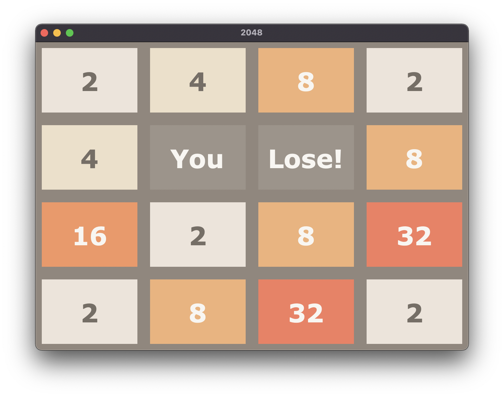

# 2048 GAME

2048 is a single-player sliding tile puzzle video game.

## Description

Developed 2048 game using python and tkinter.



### Dependencies

* Python 3

### Executing program

* Clone the repository
```
git clone https://github.com/magdumsuraj07/2048-game.git
```
* Run using python3 interpreter
```
python3 2048.py
```